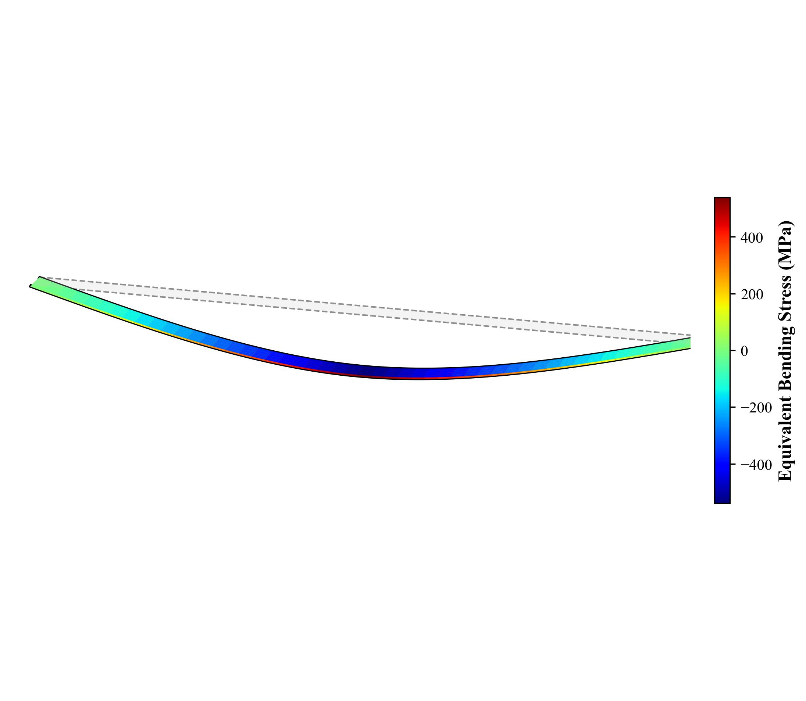
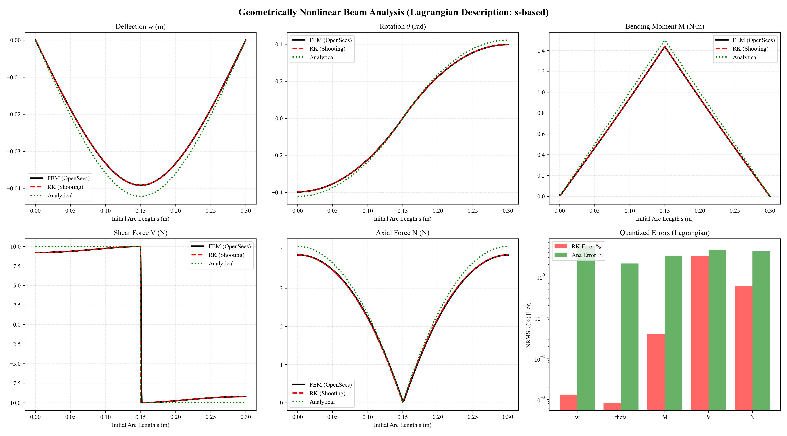
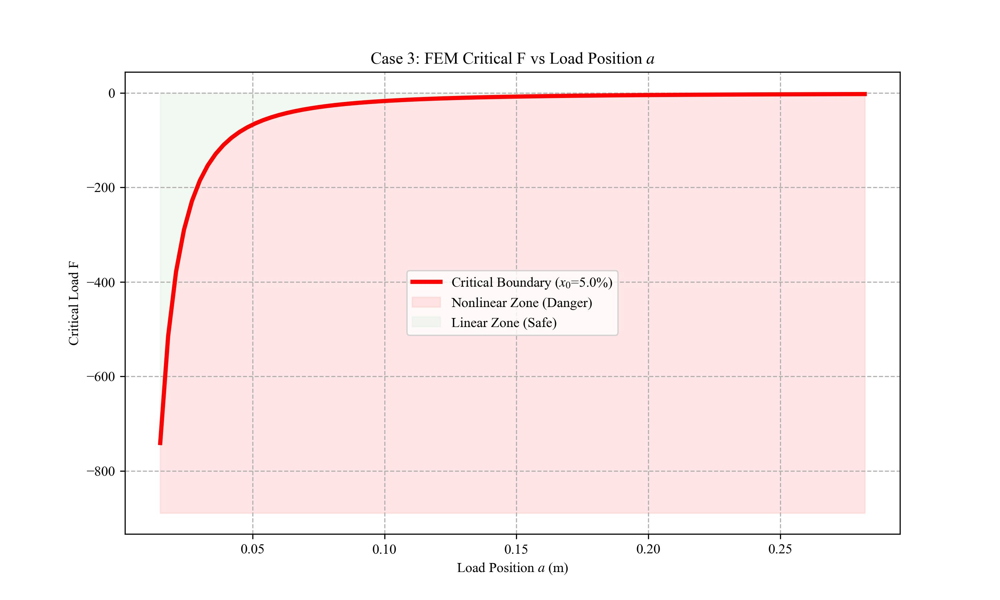

### 🇹🇼 Traditional Chinese (`README.zh-TW.md`)

# 歐拉彈性力學 & 非線性樑分析器
[English](README.md) | [Français](README.fr.md) |  [Español](README.es.md) |[繁體中文](README.zh-TW.md) | [简体中文](README.zh-CN.md) | [Deutsch](README.de.md) | [日本語](README.ja.md) | [한국어](README.ko.md)
<div align="center">
  
  <p><em>簡支樑在極端中點載荷下的大變形（共旋轉FEM）。</em></p>
</div>

一個基於 Python 的高穩健性計算力學框架，旨在求解、模擬和驗證**大變形幾何非線性樑（歐拉彈性體）**。

透過對三個不同的數學維度（解析解、龍格-庫塔打靶法和共旋轉FEM）進行交叉驗證，該工具明確地描繪出線性假設与非線性現實之間的精確數值邊界。

## 🧮 理論基礎

傳統的線性力學（歐拉-白努利樑理論）透過假設無窮小轉角 ($w' \approx 0$) 來簡化精確的曲率方程式，這導致在極端載荷下嚴重高估撓度。本框架透過保留完整的幾何非線性，從根本上解決了**歐拉彈性體**問題：

$$ \kappa = \frac{M(x)}{EI} = \frac{w''}{(1 + (w')^2)^{3/2}} $$

這個高度耦合的非線性微分方程對於大多數複雜的載荷情況缺乏封閉形式的解析解，因此需要本專案中實作的進階數值求解器。

## ⚙️ 技術細節與演算法

該框架透過三個獨立的求解器引擎和先進的空間映射實現了高保真度驗證：

### 1. 三重數學交叉驗證與拉格朗日對齊
* **線性基準：** 基於經典歐拉-白努利小撓度理論的封閉形式解。這作為量化非線性發散閾值的比較基準。
* **精確非線性引擎：** 對精確的歐拉彈性體微分方程進行龍格-庫塔積分。
* **FEM黃金標準：** 使用 `Corotational` 幾何非線性公式的 OpenSeesPy。
* **原子級拉格朗日對齊：** 由於極端彎曲，樑的水平投影會急劇縮小。所有的誤差評估和視覺化都嚴格在**拉格朗日座標系**中執行（基於初始弧長 $s$，透過 `scipy.interpolate.interp1d` 實作）。這有效地解決了歐拉座標系中極端幾何變形固有的空間錯位問題。

### 2. RK打靶法引擎
* **狀態空間公式化：** 將高階微分方程轉換為一階常微分方程組，建立狀態向量 $\mathbf{y} =[w, \theta, M, V, N]^T$。
* **邊界值問題(BVP)到初始值問題(IVP)的轉換：** 透過打靶法求解邊界值問題(BVP)。它使用**Levenberg-Marquardt (`lm`) 演算法** (`scipy.optimize.least_squares`) 迭代地最佳化初始猜測，有效防止在深度彎曲區域雅可比矩陣出現奇異。
* **不連續性處理：** 實作分段連續的邊界匹配條件，以平滑地解決內力/力矩的跳躍。

### 3. 自動化邊界搜尋引擎
* **求根演算法：** 整合**Brent方法** (`scipy.optimize.brentq`)，動態尋找線性解析模型與非線性FEM模型之間相對誤差達到嚴格**5%閾值**時的精確施加载荷（或載荷位置）。

### 4. 零依賴高保真3D渲染
* 避免了重型的3D科學視覺化函式庫（如VTK、Mayavi或ParaView）。它透過數學方式將一維樑單元重建為三維實體，並將等效應力張量映射到表面，使用**純Matplotlib**生成可用於出版的3D等軸測應力雲圖。

## 📦 環境設定

本專案是一系列計算性Python腳本的集合。一旦滿足相依性關係，您就可以直接執行它們。

### 選項A：標準設定 (Windows / macOS / 基於Debian / 基於Red Hat)
對於標準作業系統環境，使用虛擬環境是可選的，但建議使用以避免相依性衝突。
```bash
# 1. 複製儲存庫
git clone https://github.com/LwhJesse/Euler-Elastica-Py.git
cd Euler-Elastica-Py

# 2. (可選) 建立並啟用虛擬環境
python3 -m venv venv
source venv/bin/activate  # 在Windows上使用: venv\Scripts\activate

# 3. 安裝核心相依性
pip install --upgrade pip
pip install -r requirements.txt
```
> **⚠️ macOS Apple Silicon (M1/M2/M3) 使用者注意：** `openseespy` 是一個C++封裝的框架。如果 `pip` 無法找到相容的ARM64 wheel檔案，您可能需要使用Rosetta 2執行您的終端機，或參考 [OpenSeesPy官方安裝文件](https://openseespydoc.readthedocs.io/en/latest/src/installation.html)。

### 選項B：基於Arch的Linux (AUR)
如果您使用的是基於Arch的Linux，全域 `pip` 安裝是外部管理的 (PEP 668)。您可以安全地跳過虛擬環境，直接透過系統套件管理器安裝相依性。
*(註：`python-openseespy` AUR套件由本儲存庫作者 [@LwhJesse](https://aur.archlinux.org/packages/python-openseespy) 官方維護)。*
```bash
# 1. 複製儲存庫
git clone https://github.com/LwhJesse/Euler-Elastica-Py.git
cd Euler-Elastica-Py

# 2. 透過pacman和您的AUR輔助程式 (例如yay) 安裝相依性
sudo pacman -S python-numpy python-pandas python-scipy python-matplotlib python-rich
yay -S python-openseespy
```

## 🚀 使用指南

專案依賴位於 `core/config.py` 中的單一參數設定檔。

### 1. 單一案例分析
執行單個案例以生成2D拉格朗日比較圖：
```bash
python run_single.py
```
為當前設定生成3D等軸測應力雲圖：
```bash
python run_3d_render.py
```

### 2. 批次執行與基準測試
執行所有10個預定義的基準案例，以生成一套全面的驗證套件：
```bash
python run_batch.py
python run_batch_3d.py
```
<details>
<summary><b>點擊查看：精確RK vs FEM多物理場對齊 (案例8)</b></summary>
<br>
<div align="center">
  
  <p><em>請注意，線性解析解（綠色）出現了劇烈偏差，而RK（紅色）和FEM（黑色）則完美對齊。</em></p>
</div>
</details>

### 3. 臨界邊界搜尋 (即時叢集)
利用一個由 `rich` 驅動的即時終端儀表板，在所有CPU核心上並發地描繪出5%非線性誤差的相邊界：
```bash
python run_multiprocess.py
```
<details>
<summary><b>點擊查看：雙變數安全/危險區域圖 (案例3)</b></summary>
<br>
<div align="center">
  
  <p><em>紅色的臨界邊界明確地指示了何時必須採用幾何非線性模型。</em></p>
</div>
</details>

## 🛠️ 支援的基準載荷案例

| 案例ID | 邊界條件 | 載荷類型 | 活動變數 |
| :---: | :--- | :--- | :--- |
| **1** | 懸臂樑 | 端部彎矩 | $M_e$ |
| **2** | 懸臂樑 | 端部集中力 | $F$ |
| **3** | 懸臂樑 | 中間集中力 | $F, a$ |
| **4** | 懸臂樑 | 均布載荷 | $q$ |
| **5** | 簡支樑 | 左端力矩 | $M_e$ |
| **6** | 簡支樑 | 右端力矩 | $M_e$ |
| **7** | 簡支樑 | 中間力矩 | $M_e, a$ |
| **8** | 簡支樑 | 中點集中力 | $F$ |
| **9** | 簡支樑 | 中間集中力 | $F, a$ |
| **10** | 簡支樑 | 均布載荷 | $q$ |

## 📁 輸出目錄結構
結果與原始碼完全隔離，並自動組織：
- `results/single_runs/` : 手動設定的快照和渲染圖。
- `results/batch_runs/` : 10個基準案例的完整驗證套件。
- `results/boundary_analysis/` : 動態誤差演化和臨界閾值曲線。
- `results/mesh_convergence/` : 網格收斂性驗證圖。

## 📄 授權條款
本專案採用MIT授權條款 - 詳情請見[LICENSE](LICENSE)檔案。

